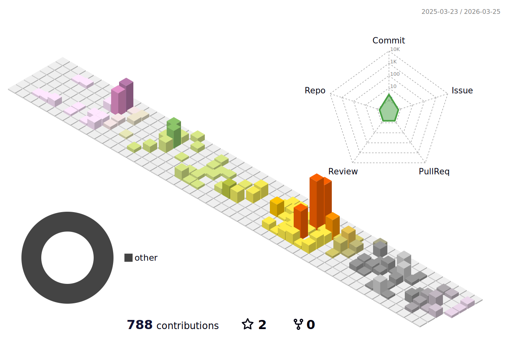

## 🎮 Breakout Game
<!-- 画像は Actions が出力するものを github-breakout ブランチに集約して参照します -->
<picture>
  <source media="(prefers-color-scheme: dark)"
          srcset="https://raw.githubusercontent.com/naokoo/naokoo/github-breakout/images/breakout-dark.svg" />
  <source media="(prefers-color-scheme: light)"
          srcset="https://raw.githubusercontent.com/naokoo/naokoo/github-breakout/images/breakout-light.svg" />
  
</picture>

> 生成と配置は GitHub Actions（`cyprieng/github-breakout`）で自動更新。
